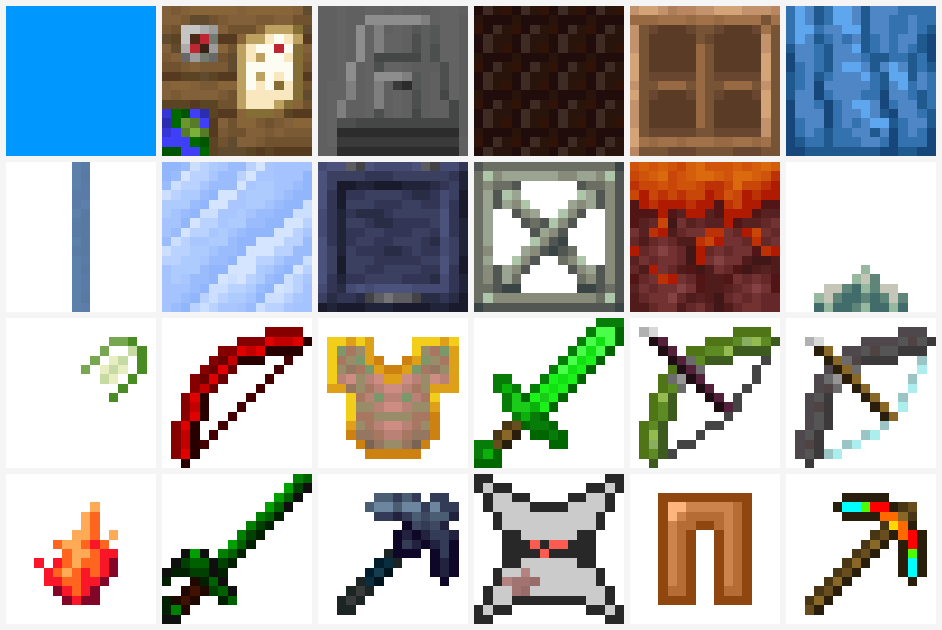
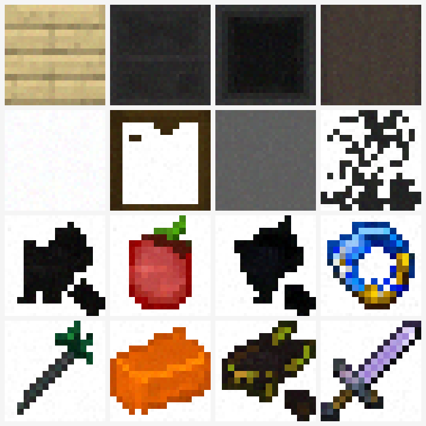

# MC-Gen 2.0

Generate **Minecraft / voxel-game low-resolution textures** (32×32, RGBA) from text
with a compact **pixel-space Rectified-Flow Transformer**.

The model works directly on pixels (no VAE), runs on a single 40–80 GB GPU, and targets
seamless, palette-faithful textures for resource packs, pixel-art assets and mod content.

- Model: `MC-FlowDiT` (~130 M) — pixel-space MMDiT double-stream + single-stream
- Resolution: 32×32 × 4 (RGBA), patch size 2, 2D RoPE, RMSNorm + QK-Norm, AdaLN-Zero
- Objective: Rectified Flow / Flow Matching + optional edge (tile) loss
- Text conditioning: frozen **Qwen3-8B** token states injected by **cross-attention**
- License: **research / study only** (see *Licensing*)

> Datasets are hosted on Hugging Face: **https://huggingface.co/datasets/Risposta/MC_Gen**
> This repository contains the code only.

---

## Results

32×32 block and item textures (nearest-neighbour, transparent background shown white):



Model generations (`MC-FlowDiT`, Stage 2 grounded prompts):



---

## Features

- **Pixel-space flow model** — no VAE, so pixel edges, palette and tile seams are preserved.
- **Cross-attention text conditioning** — image tokens query a frozen Qwen3-8B token
  sequence (layers 9/18/27 concatenated → 12 288-d), computed **on the fly** (no
  precomputed text embeddings).
- **Prompt pipeline** — source filenames are the authoritative labels: orientation and
  abstract words are preserved verbatim, the `block` / `item` type is kept, and colour /
  shape are inferred from the label (rule-based) and optionally rewritten by an LLM.
- **Curated Stage-3 set** — a category-balanced subset (63 forms × 61 materials × 30
  colours × 48 states) annotated by a local 27B VLM with a strict, validated JSON rule.
- **Anti-forgetting fine-tuning** — Stage-3 uses Stage-2 replay mixing, a low LR / short
  schedule, CPU EMA, an optional backbone freeze (train only the conditioning path), and
  forgetting-aware checkpoint selection.
- **Evaluation suite** — concept recall, colour accuracy, real-vs-generated fidelity,
  seam score, seed diversity, retrieval accuracy and text-effect (val loss vs null).

---

## Method (brief)

**Data curriculum**

```text
Stage 1  pixel-art assets (Kenney / itch.io / OpenGameArt / Alucard) + all MC textures
   ↓      (image-only pretraining of the pixel flow prior)
Stage 2  MC textures + grounded prompts  → text alignment
   ↓
Stage 3  curated subset + 27B fine annotations + Stage-2 replay → precise text control
```

**Prompts** — each texture keeps its source-label words. Two prompt sources are used:
a deterministic grounded rewrite (`scripts/rewrite_grounded.py`) and a validated LLM
rewrite (`src/data/grounded_rewrite.py`) that must keep every label word and the type.

**Text tower** — `Qwen3-8B` causal LM, chat template with `enable_thinking=False`,
hidden states from layers 9/18/27 concatenated (FLUX.2-klein style); frozen, run on a
second GPU during training. `src/data/text_tower.py`.

**Model** — `src/model/mc_flow_dit.py`: patch embed → MMDiT blocks → cross-attention to
text tokens → single-stream blocks → velocity head. 2D RoPE, QK-Norm, AdaLN-Zero.
`text_injection: cross_attn` keeps a learned register token in the MMDiT streams so
Stage-1 weights transfer.

**Inference** — `Heun` / `Euler` flow ODE, 16–24 steps, CFG ~2–3, frozen text tower,
single learned null condition.

---

## Repository layout

```text
configs/
  data/      dataset descriptors (stage_1, stage_2_grounded_k1, stage_3, ...)
  model/     tiny / base / base_flux2klein
  train/     per-stage recipes
  annotator.yaml, prompt_rewrite.yaml, grounded_rewrite.yaml, stage3_annotator.yaml
src/
  data/      builders, processors, text tower, annotators, prompt pipelines
  model/     MC-FlowDiT blocks (double/single stream, cross-attention, RoPE)
  train/     flow, losses, EMA, trainer
  infer/     solvers, sampling, FastAPI service
  eval/      seam, attributes, diversity, memorization, caption bench
scripts/     train / sample / build_data / annotate / rewrite / eval entry points
docs/images/ result figures
data/        (downloaded, git-ignored) raw + built datasets
```

---

## Quickstart

```bash
# setup
pip install -r requirements.txt
python scripts/download_dataset_hf.py          # datasets from HF

# Stage 2 (grounded prompts, Qwen3-8B cross-attention)
python scripts/train.py \
  --model configs/model/base_flux2klein.yaml \
  --train configs/train/stage_2_grounded_k1.yaml \
  --init-from checkpoints/stage_1/latest.pt

# Stage 3 (27B-annotated subset + Stage-2 replay, anti-forgetting)
python scripts/annotate_stage3.py --num-shards 2 --shard-index 0 \
  --endpoints http://127.0.0.1:8000/v1/chat/completions     # then --merge
python scripts/train.py \
  --model configs/model/base_flux2klein.yaml \
  --train configs/train/stage_3.yaml \
  --init-from checkpoints/stage_2_grounded_k1/best.pt
# optional frozen-conditioning variant: configs/train/stage_3_frozen.yaml

# sample and evaluate
python scripts/sample.py --ckpt checkpoints/stage_2_grounded_k1/best.pt \
  --text-tower /path/to/Qwen3-8B --prompt "orange brick item" "mossy stone bricks block"
python scripts/eval_generation.py --ckpt checkpoints/stage_2_grounded_k1/best.pt
```

Serving the annotators (vLLM, one replica per GPU):

```bash
CUDA_VISIBLE_DEVICES=0 python scripts/serve_vlm.py \
  --model /path/to/Qwen3.8-27B --served-model-name qwen3.8-27b --port 8000 --mtp 2
```

---

## Data

Built datasets are raw NumPy mmaps:

```text
<name>/
├── images.uint8.mmap      # headerless uint8 (N, 32, 32, C)
├── metadata.parquet       # type, file_name, mod_slug, project_id, ...
├── splits.json            # {"train": [...], "val": [...], "test": [...]}
├── grounded_prompts.parquet   # prompt_0 (+ fallbacks) from source labels
└── stage3_prompts.parquet     # 27B fine annotations for the curated subset
```

Prompts are read as **strings** and encoded on the fly by the frozen text tower
(`prompt_views` + `prompt_cols` in the data config, `MmapImageTextDataset`).

---

## Licensing

Research and study only. The datasets aggregate third-party game assets under mixed
licenses (CC0, CC-BY, OGA-BY, MIT, GPL, …); per-sample provenance is kept in
`source_metadata`. Minecraft / Mojang assets are **not** redistributed as training data.
Do not use the data or trained models commercially.
